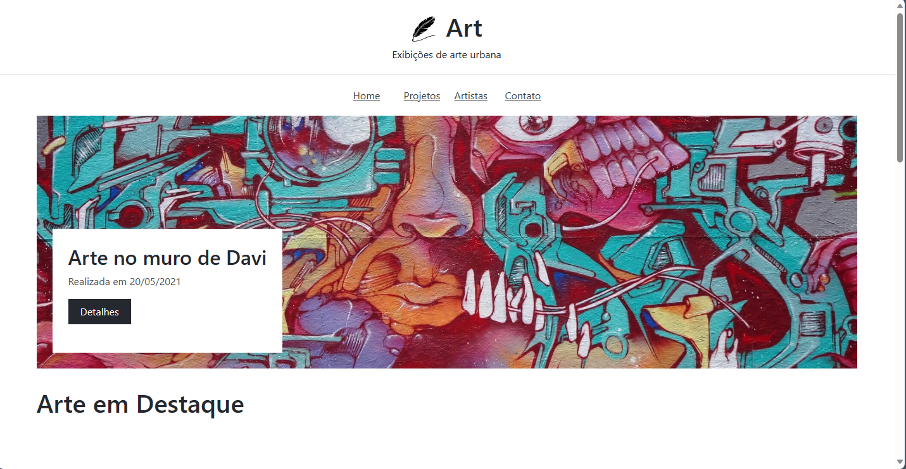

# Art

Art é um projeto que fiz usando bootstrap para entender como funciona melhor a biblioteca, esse design foi retirado do curso de Bootstrap do Matheus Battisti - Hora de Codar

[EN] Art is a project I made using bootstrap to understand how the library works better, this design was taken from Matheus Battisti's Bootstrap course - Hora de Codar

## Home

## Feedback

Se você tiver algum feedback, por favor me informe para eu evoluir meus conhecimentos.

[EN] If you have any feedback, please let me know so I can improve my knowledge.

## Contribuindo

Contribuições são sempre bem-vindas!

[EN] Contributions are always welcome!

